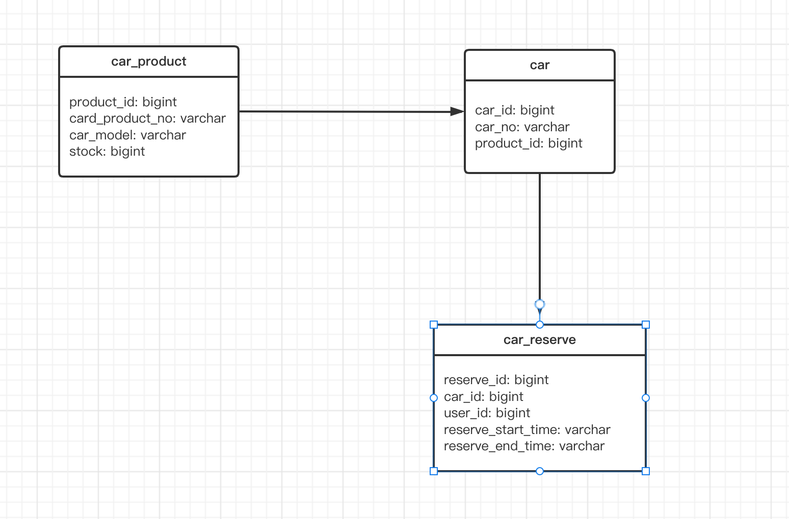

### Car Rental

设计一个可以提供汽车预约时段功能的后端


#### 1. 系统 ER 图



简单起见，项目使用的 h2 数据库 + spring jpa

库里已经存在的数据如下：

```java
        CarProductDO carProductDO1 = new CarProductDO(1L, "ToyotaCamry", "Toyota Camr", 2L);
        CarProductDO carProductDO2 = new CarProductDO(2L, "BMW650", "BMW 650", 2L);
        carProductRepository.save(carProductDO1);
        carProductRepository.save(carProductDO2);

        CarDO carDO1 = new CarDO("ToyotaCamry1", 1L);
        CarDO carDO2 = new CarDO("ToyotaCamry2", 1L);
        CarDO carDO3 = new CarDO("BMW6501", 2L);
        CarDO carDO4 = new CarDO("BMW6502", 2L);
        carRepository.save(carDO1);
        carRepository.save(carDO2);
        carRepository.save(carDO3);
        carRepository.save(carDO4);
        return ResponseEntity.ok().body("success");
```


#### 2. api

集成了 swagger，入口：http://localhost:8080/swagger-ui.html

有两个接口：

1. 获取可预约时段 

   ```java
   com.lingjiancong.car.controller.CarReserveController#getCarReserveTime
   ```

2. 预约时段

   ```java
   com.lingjiancong.car.controller.CarReserveController#carReserveTime
   ```


#### 3. 测试

集成测试：

```java
com.lingjiancong.car.controller.CarReserveControllerIntegrationTest
```

单元测试：

```java
com.lingjiancong.car.repository.CarRepositoryTest
```

